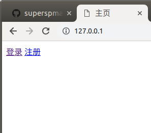
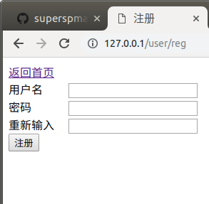
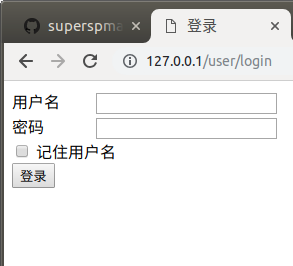
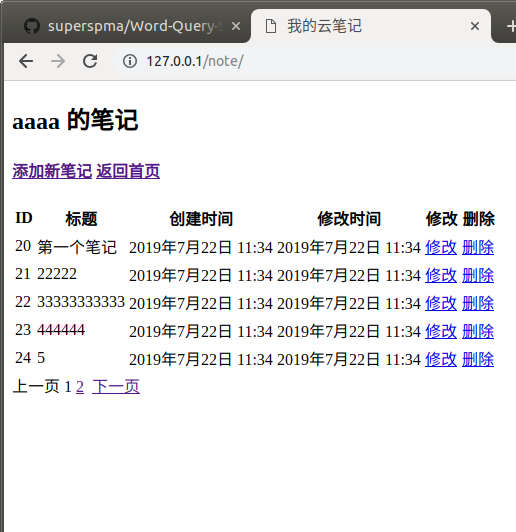

Django_Web_Server
==========================

| Python Django |
| --- |
| Author：马三平|
| Date：2019-7-22|

-----------

[TOC]

实现网络云笔记

    - 功能:
    
         注册
         登陆
         查看以前自己的笔记
         自己写一个新的笔记
         修改以前的笔记
         删除笔记
    - 模型类
    
        class User(models.Model):
            ...
        class Note(models.Model)：
            title = CharField(...)  # 标题
            content = CharField(...)  # 内容
            user = models.ForeignKey(User)   # 关联用户外键
            create_time = models.DateField(...)  # 创建时间
            mod_time = models.DateField(...)  # 修改时间
 
 
 >参考:
    
    
>>主页面

 >>注册界面
 

 >>登陆界面
 

 >>云笔记页面
 

    
